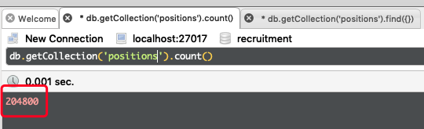
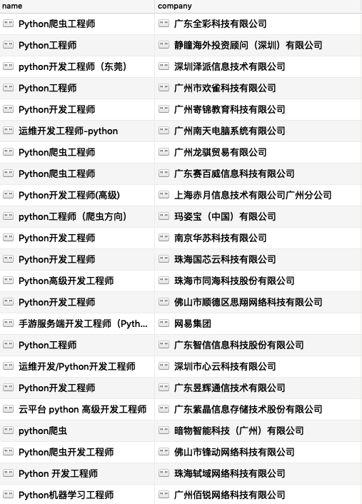
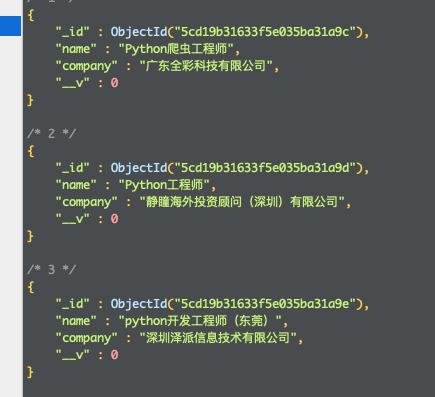

# 使用Crawler（类似于requests）框架，爬取51job所有python工程师职位，以及公司名


## 项目介绍：

1. 实现对51job所有**python关键字的职位**名称，以及**公司的名称**爬取的过程
2. 创建了Position(职位)的model，便于连接到数据库，实现保存
3. 使用MongoDB保存了所有爬取到的数据


## 项目难点：

1. 使用css选择器，找到对应的元素
2. 使用debug找到元素里面的实际数据
3. 使用mongoose创建MongoDB数据库连接，使用创建对象的api，保存到数据里面
4. 创建标识符，在爬取完毕之后，提示开发人员


## 依赖：

```shell
crawler
mongoose
MongoDB
nodejs
```


## 安装 & 使用：

``` shell
git clone https://github.com/ReadRou/51_spider.git
npm i
node listCrawler.js
```


## 效果截图

**数据条数**



**table展示**



**json展示**




